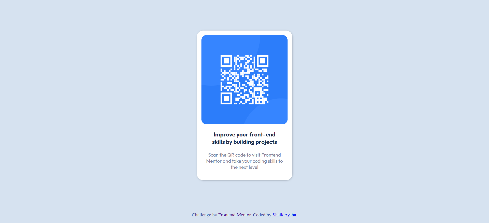

# Frontend Mentor - QR code component solution

This is a solution to the [QR code component challenge on Frontend Mentor](https://www.frontendmentor.io/challenges/qr-code-component-iux_sIO_H). Frontend Mentor challenges help you improve your coding skills by building realistic projects.

## Table of contents

- [Overview](#overview)
  - [Screenshot](#screenshot)
  - [Links](#links)
- [My process](#my-process)
  - [Built with](#built-with)
  - [What I learned](#what-i-learned)
- [Author](#author)

## Overview

### Screenshot

### Links

- Solution URL: [My solution](https://github.com/aysha56/QR-Code-Component)
- Live Site URL: [My website](https://qrcode-69.netlify.app/)

## My process

### Built with

- HTML
- CSS
- Flexbox

### What I learned

In this project, I gained a better understanding of CSS Flexbox.

## Author

- Website - [Aysha Shaik](https://github.com/aysha56)
- Frontend Mentor - [@aysha](https://www.frontendmentor.io/profile/aysha56)
